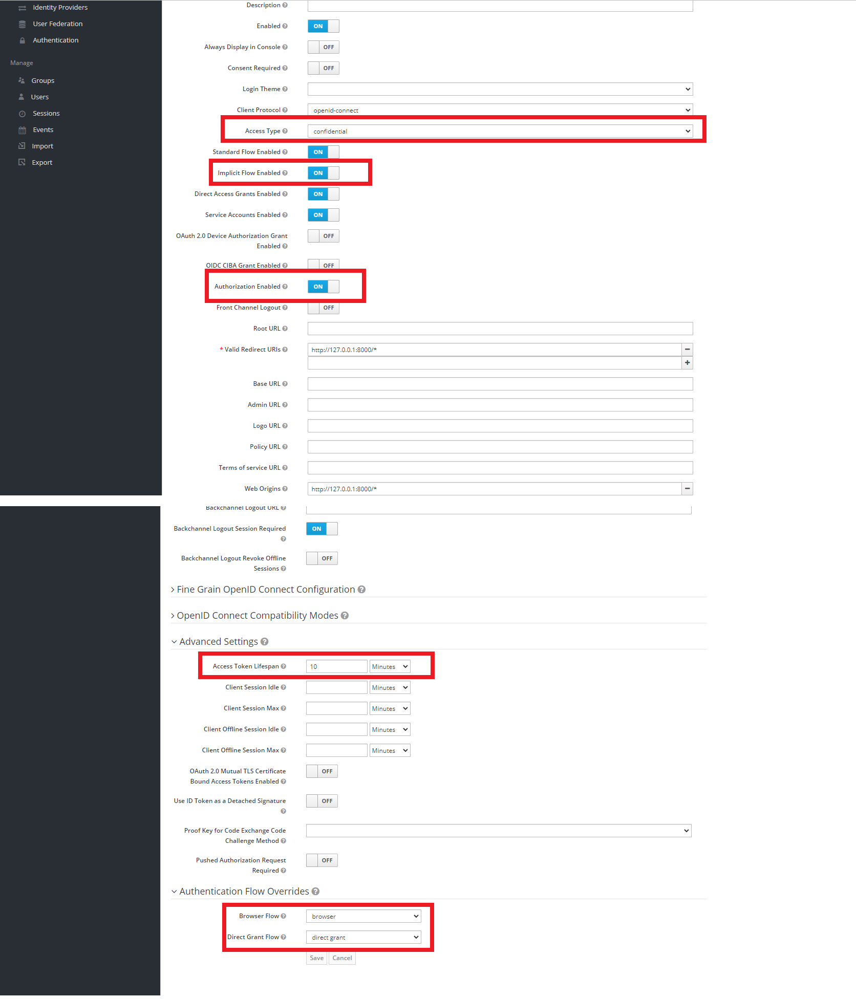
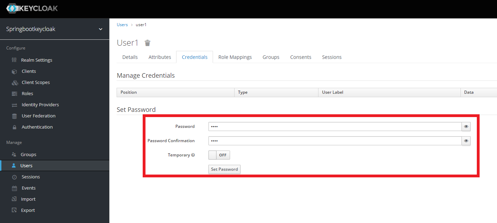
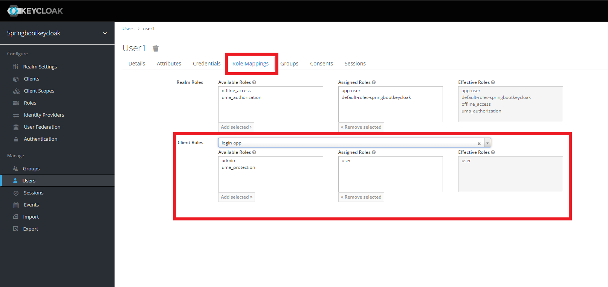

### Spring Boot(Kotlin) + Spring Security + Keycloak Demo

#### Docker Keycloak + MariaDB 설정 및 KeyCloak 기본 사용법 
1. Keycloak 이미지와 MariaDB 이미지를 다운 받는다.

```
[root@~]# docker pull jboss/keycloak
[root@~]# docker pull mariadb
```

2. Docker network 를 생성한다.

```
[root@~]# docker network create keycloak-network
```

3. MariaDB 인스턴스를 생성한다.

```
[root@~]# docker run -d --name mariadb \
--net keycloak-network \
-p 3300:3306 \
-e MYSQL_ROOT_PASSWORD=secret \
-e MYSQL_DATABASE=keycloak \
-e MYSQL_USER=keycloak \
-e MYSQL_PASSWORD=secret \
mariadb
```

4. Keycloak 인스턴스를 생성한다.([참고-Keycloak Docker 설정](https://hub.docker.com/r/jboss/keycloak))

```
[root@~]# docker run -d --name keycloak \
--net keycloak-network \
-p 8000:8080 \
-e KEYCLOAK_USER=admin \
-e KEYCLOAK_PASSWORD=secret \
-e DB_ADDR=mariadb \
-e DB_PORT=3306 \
-e DB_DATABASE=keycloak \
-e DB_PASSWORD=secret \
-e DB_USER=keycloak \
jboss/keycloak
```

5. 정상적으로 Keycloak 인스턴스가 생성되었다면 브라우저에 http://127.0.0.1:8000/auth/ 주소고 접속하면 Welcome to Keycloak 사이트가 나올 것이다. 여기서 Administration Console 로 접속하면 된다.


6. 5번이 정상적으로 완료가 되었다면 MariaDB에 접속하면 keycloak 데이터베이스에 keycloak 관련 테이블이 생긴것을 확인 할 수 있다.


7. Keycloak 관리자에서 4번에서 설정한 아이디와 비밀번호로 접속을 합니다.


8. 왼쪽 상단 Master 에 마우스를 올려두면 Realm 을 생성 할 수 있다. 신규 Realm 을 하나 생성한다. Realm 이름은 springbootkeycloak 이다.

9. 왼쪽 Client 메뉴로 이동 후 Create 버튼을 클릭하여 Client 를 생성합니다. Client 이름은 login-app 이다.


10. Client 생성한 뒤 이동된 페이지의 하단에 Valid Redirect URIs 항목에 http://127.0.0.1:9000/* 을 입력 후 맨 하단의 Save 버튼을 누릅니다. 9000 포트는 스프링부트 어플리케이션의 포트이다. 그외에 빨간색 네모 부분을 설정한다.


11. 왼쪽 Roles 메뉴로 이동 후 Add Role 버튼을 클릭하여 user 라는 Role 을 생성한다.


12. 왼쪽 Users 메뉴로 이동 후 Add user 버튼을 클릭하여 user1 이라는 사용자를 생성한다.


13. user1 생성 후 Credentials 탭으로 이동 후 비밀번호를 설정 후 하단의 Set Password 버튼을 누른다.


14. 상단 Role Mappings 탭으로 이동 후 Client Roles > login-app 선택 후 Available Roles 에서 11번에서 생성한 user Role 을 클릭 후 Ad Selected 버튼을 클릭하면 user Role 이 Assigned Roles 로 이동한다. 이렇게 되면 완료된 상태이다.


15. 설정이 완료되었으면 postman 프로그램을 이용하여 로그인 테스트가 가능하다. 로그인이 정상적으로 되었으면 토큰이 발급된다.
